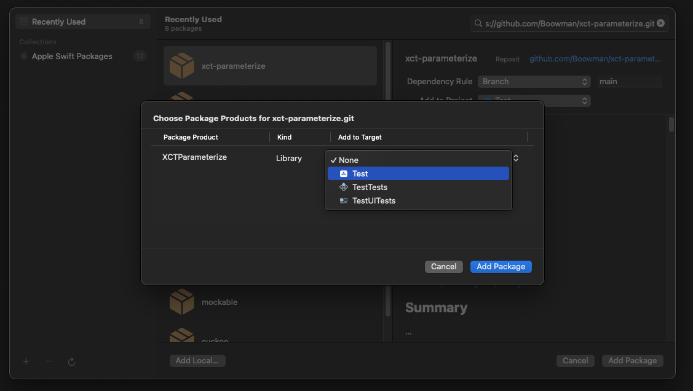

# XCTParameterize

<div>
    <a href="https://github.com/Boowman/xct-parameterize"></a>
    <a href="https://www.swift.org/"></a>
    <a href="https://developer.apple.com/xcode/"></a>
    <a href="https://github.com/Boowman/xct-Parameterize?tab=MIT-1-ov-file"></a>
</div>

## Table of contents

- [Summary](https://github.com/Boowman/xct-parameterize?tab=readme-ov-file#summary)
- [Requirements](https://github.com/Boowman/xct-parameterize?tab=readme-ov-file#requirements)
- [Installation](https://github.com/Boowman/xct-parameterize?tab=readme-ov-file#installation)
    - [SPM](https://github.com/Boowman/xct-parameterize?tab=readme-ov-file#swift-package-manager)
    - [Package](https://github.com/Boowman/xct-parameterize?tab=readme-ov-file#adding-it-to-a-package)
- [Examples without the package](https://github.com/Boowman/xct-parameterize?tab=readme-ov-file#examples-reason-why-we-need-it)
- [Examples using the package](https://github.com/Boowman/xct-parameterize?tab=readme-ov-file#examples-how-to-use-xctParameterize)

## Summary

...

## Requirements

Xcode 15 or above
Swift 5.9 or later

## Installation

#### Swift Package Manager

1. In Xcode, navigate to the menu: File > Swift Packages > Add Package Dependency
2. Add `https://github.com/loubenita/xct-parameterize.git`
3. For the Dependency Rule, Select "Up to Next Major" with `1.0.0`. Click Add Package.
4. Under `Package Product` look for XCTParameterize and under `Target` select your test target.
5. Click Add Package.

<p align="left">
    
</p>

#### Adding it to a package

1. In `Package.swift` add:

``` swift
    dependencies: [
        ...
      .package(url: "https://github.com/loubenita/xct-parameterize.git", branch: "1.0.0")
    ]
```

2. Add the product to your test target again inside `Package.swift`

```swift
    .testTarget(
        name: <Your Test Target>,
        dependencies: [
            ...
            .product(name: "XCTParameterize", package: "XCTParameterize"),
        ]
    )
```

## Examples [Reason why we need it]

- Let's say you would like to concatenate some strings and you would like to test the outcomes.
```swift
public class StringUtils {

    func concatenate(a: String, b: String) -> String {
        return a + b;
    }
    
}
```

- Traditionally to `UnitTest` the above with multiple provided strings it would look something like the below.  It tests, it's readable and more importantly it passes, but the main problem here is if you need to write multiple checks, now image the same thing but for different `Util` classes and so on. You can imagine how much code will end up being duplicated.
```swift
    func testHellWorld() throws {
        // Arrange
        let util = StringUtils()
        let a = "Hello"
        let b = "World"
        
        // Act
        let result = util.concatenate(a: a, b: b)
        
        // Assert
        XCTAssertEqual(result, "HelloWorld")
    }
    
    func testOpenAI() throws {
        // Arrange
        let util = StringUtils()
        let a = "Open"
        let b = "AI"
        
        // Act
        let result = util.concatenate(a: a, b: b)
        
        // Assert
        XCTAssertEqual(result, "OpenAI")
    }
}
```

### OR

```swift
func testConcatenate() throws {
        // Arrange
        let stringUtils = StringUtils()
        let testCases: [(String, String, String)] = [
            ("Hello", "World", "HelloWorld"),
            ("Open", "AI", "OpenAI"),
            ("", "Test", "Test")
        ]

        // Act & Assert
        for (a, b, expectedResult) in testCases {
            let result = stringUtils.concatenate(a: a, b: b)
            XCTAssertEqual(expectedResult, result)
        }
    }
```

### OR

```swift
 func testConcatenate() throws {
        // Arrange
        let stringUtils = StringUtils()
        
        // Act & Assert for each test case
        performConcatenationTest(stringUtils: stringUtils, a: "Hello", b: "World", expectedResult: "HelloWorld")
        performConcatenationTest(stringUtils: stringUtils, a: "Open", b: "AI", expectedResult: "OpenAI")
        performConcatenationTest(stringUtils: stringUtils, a: "", b: "Test", expectedResult: "Test")
    }
    
    func performConcatenationTest(stringUtils: StringUtils, a: String, b: String, expectedResult: String) {
        // Act
        let result = stringUtils.concatenate(a: a, b: b)
        
        // Assert
        XCTAssertEqual(expectedResult, result)
    }
}
```
- Now that we've seen the other ways of doing it how about we jump right in and I show you how you can do it using XCTParameterize

## Examples [How to use XCTParameterize]

```swift
import XCTParameterize

public class StringUtilsTests: XCTestCase {
    @InlineData("Hello", "World", "HelloWorld")
    @InlineData("Open", "AI", "OpenAI")
    @InlineData("", "Test", "Test")
    func testConcatenate(a: String, b: String, expectedResult: String) throws {
        // Arrange
        let stringUtils = StringUtils()
        
        // Act
        let result = stringUtils.concatenate(a: a, b: b)
        
        // Assert
        XCTAssertEqual(expectedResult, result)
    }
}
```

- The above will result in the following macros being created
```swift
    func testConcatenate_Test_Test() throws {
        let a: String = ""
        let b: String = "Test"
        let expectedResult: String = "Test"

        let stringUtils = StringUtils()
        let result = stringUtils.concatenate(a: a, b: b)
        XCTAssertEqual(expectedResult, result)
    }
    func testConcatenate_Open_Ai_Openai() throws {
        let a: String = "Open"
        let b: String = "AI"
        let expectedResult: String = "OpenAI"

        let stringUtils = StringUtils()
        let result = stringUtils.concatenate(a: a, b: b)
        XCTAssertEqual(expectedResult, result)
    }
    func testConcatenate_HelloWorld() throws {
        let a: String = "Hello"
        let b: String = "World"
        let expectedResult: String = "HelloWorld"

        let stringUtils = StringUtils()
        let result = stringUtils.concatenate(a: a, b: b)
        XCTAssertEqual(expectedResult, result)
    }
```

- If you would like to give the method a specific name as long strings could end up giving the method name an unreadable name.
```swift
import XCTParameterize

public class StringUtilsTests: XCTestCase {
    @InlineData("Hello", "World", "HelloWorld", label: "_Verify_HelloWorld")
    func testConcatenate(a: String, b: String, expectedResult: String) throws {
        // Arrange
        let stringUtils = StringUtils()
        
        // Act
        let result = stringUtils.concatenate(a: a, b: b)
        
        // Assert
        XCTAssertEqual(expectedResult, result)
    }
}
```
- The above will result in the following macro being created
```swift
    func testConcatenate_Verify_HelloWorld() throws {
        let a: String = "Hello"
        let b: String = "World"
        let expectedResult: String = "HelloWorld"

        let stringUtils = StringUtils()
        let result = stringUtils.concatenate(a: a, b: b)
        XCTAssertEqual(expectedResult, result)
    }
```
